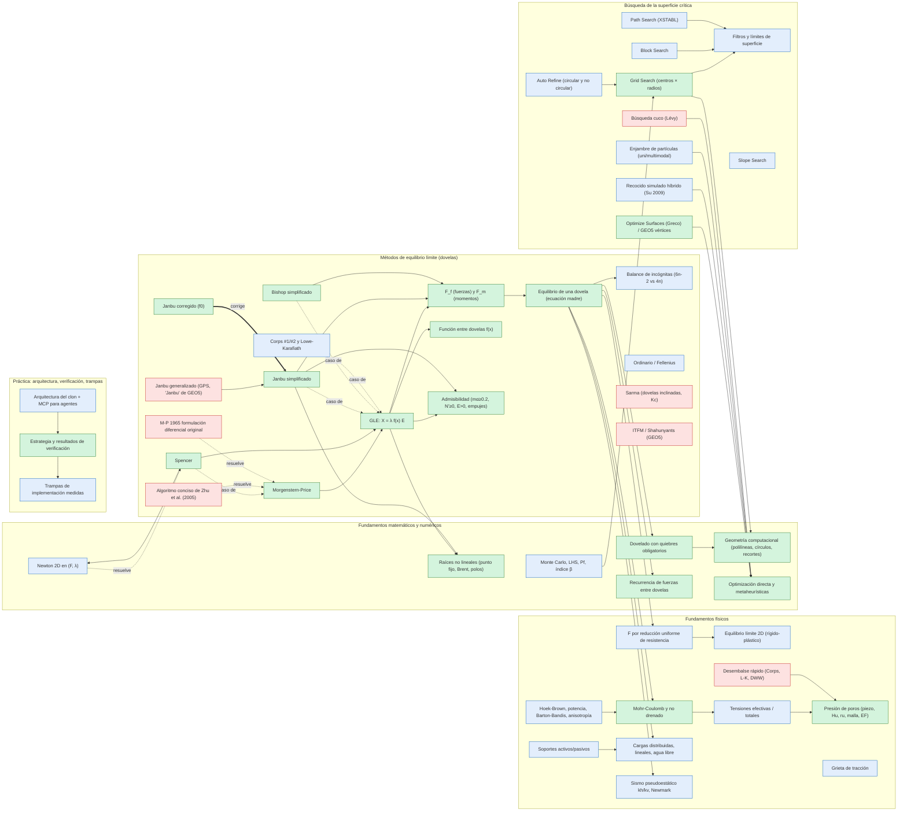

# Grafo de conocimiento — vista general

> Generado por `grafo.py` (no editar a mano). Verde = verificado numéricamente, azul = documentado con fuente accesible, rojo = pendiente de fuente primaria o implementación.
> Flechas continuas: "requiere". Fuentes, benchmarks e implementaciones están en `grafo.json`.

## Ruta mínima para implementar Morgenstern-Price

1. Geometría computacional (polilíneas, círculos, recortes) — `teoria/02-fundamentos-matematicos.md#1-geometría-computacional-lo-que-más-código-consume-en-un-clon`
2. Dovelado con quiebres obligatorios — `teoria/02-fundamentos-matematicos.md#1-geometría-computacional-lo-que-más-código-consume-en-un-clon`
3. Equilibrio límite 2D (rígido-plástico) — `teoria/01-fundamentos-fisicos.md#1-equilibrio-límite-y-factor-de-seguridad`
4. F por reducción uniforme de resistencia — `teoria/01-fundamentos-fisicos.md#1-equilibrio-límite-y-factor-de-seguridad`
5. Presión de poros (piezo, Hu, ru, malla, EF) — `teoria/01-fundamentos-fisicos.md#3-presión-de-poros-opciones-de-slide2-y-equivalentes`
6. Tensiones efectivas / totales — `teoria/01-fundamentos-fisicos.md#2-tensiones-efectivas-y-totales`
7. Mohr-Coulomb y no drenado — `teoria/01-fundamentos-fisicos.md#4-modelos-de-resistencia-catálogo-de-slide2`
8. Cargas distribuidas, lineales, agua libre — `teoria/01-fundamentos-fisicos.md#5-cargas`
9. Sismo pseudoestático kh/kv, Newmark — `teoria/01-fundamentos-fisicos.md#5-cargas`
10. Balance de incógnitas (6n-2 vs 4n) — `teoria/03-marco-comun-dovelas.md#3-balance-de-incógnitas-por-qué-hacen-falta-hipótesis`
11. Recurrencia de fuerzas entre dovelas — `teoria/02-fundamentos-matematicos.md#2-álgebra-lineal-y-recurrencias`
12. Equilibrio de una dovela (ecuación madre) — `teoria/03-marco-comun-dovelas.md#4-equilibrio-de-una-dovela-derivación-usada-en-el-código`
13. F_f (fuerzas) y F_m (momentos) — `teoria/03-marco-comun-dovelas.md#5-equilibrio-global`
14. Función entre dovelas f(x) — `teoria/06-morgenstern-price-gle.md#4-función-entre-dovelas-fx`
15. Raíces no lineales (punto fijo, Brent, polos) — `teoria/02-fundamentos-matematicos.md#3-ecuaciones-no-lineales`
16. Admisibilidad (mα≥0.2, N'≥0, E>0, empujes) — `teoria/03-marco-comun-dovelas.md#8-controles-de-admisibilidad-obligatorios-antes-de-reportar-f`
17. GLE: X = λ f(x) E — `teoria/03-marco-comun-dovelas.md#6-la-familia-gle-cada-método-es-un-caso-particular`
18. Morgenstern-Price — `teoria/06-morgenstern-price-gle.md`
